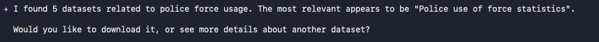
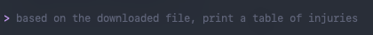
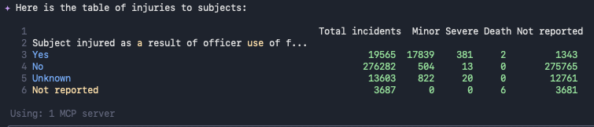

# Using NDL Core Client with AI Agents (MCP)

This library provides a **Model Context Protocol (MCP)** server for seamless integration with AI agents like Claude, Gemini, OpenAI, and others.

## What is MCP?

The [Model Context Protocol (MCP)](https://modelcontextprotocol.io/) is an open standard that enables AI agents to securely connect to external tools and data sources. By providing an MCP server, NDL Core Client can be used directly by AI assistants to search UK government datasets.

## Project Structure

The agent-related functionality is organized in the `ndl_core_client.agent` module:

```
ndl_core_client/
├── agent/
│   ├── __init__.py      # Agent module exports
│   ├── tools.py         # search_agentic function
│   └── mcp_server.py    # MCP server implementation
├── client.py            # NDLCoreClient class
└── models.py            # Pydantic models
```

## Direct Usage (Without MCP)

For programmatic use in your own agents or applications, use the `search_agentic` function directly:

```python
from ndl_core_client import search_agentic

# Search with a natural language query
response = search_agentic("police force usage", limit=10)

# Access structured results
print(f"Found {response.metadata.total_count} results")
for result in response.data:
    print(f"- {result['title']} ({result['source']})")
    print(f"  Download: {result['download']}")
```

## Installation

Install the library with MCP support:

```bash
pip install "ndl-core-client[mcp] @ git+https://github.com/theodi/ndl-core-client.git"
```

Or with uv:

```bash
uv pip install "ndl-core-client[mcp] @ git+https://github.com/theodi/ndl-core-client.git"
```

## Available MCP Tools

| Tool | Description |
|------|-------------|
| `search_ndl_corpus` | Search for UK government datasets by natural language query |
| `get_corpus_schema` | Get field descriptions for understanding search results |

### Tool: `search_ndl_corpus`

Search the NDL Core Corpus for UK open government datasets.

**Parameters:**
- `query` (string, required): Natural language search query (e.g., "police use of force statistics", "NHS waiting times data")
- `limit` (integer, optional): Maximum number of results to return (default: 10, max: 50)

**Returns:** JSON object containing:
- `total_results`: Total number of matching datasets
- `returned_results`: Number of results returned
- `results`: Array of dataset objects with title, description, source, license, format, date, tags, download_urls, and similarity_score

### Tool: `get_corpus_schema`

Get the schema and field descriptions for the NDL Core Corpus.

**Parameters:** None

**Returns:** JSON object mapping field names to their descriptions

---

## Claude Desktop

Add to your Claude Desktop config:

**macOS:** `~/Library/Application Support/Claude/claude_desktop_config.json`  
**Windows:** `%APPDATA%\Claude\claude_desktop_config.json`

```json
{
  "mcpServers": {
    "ndl-core": {
      "command": "ndl-core-mcp"
    }
  }
}
```

Restart Claude Desktop, then you can ask:

> "Find me UK government datasets about police force usage"

Claude will automatically use the `search_ndl_corpus` tool to find relevant datasets.

---

## Gemini CLI

The [Gemini CLI](https://github.com/google-gemini/gemini-cli) supports MCP servers for extending Gemini's capabilities from the command line.

### Configuration

Add the NDL Core MCP server to your Gemini CLI settings file:

**Location:** `~/.gemini/settings.json`

```json
{
  "mcpServers": {
    "ndl-core": {
      "command": "ndl-core-mcp"
    }
  }
}
```

### Usage

Once configured, you can use Gemini CLI with NDL Core tools:

```bash
# Start an interactive session
gemini

# Or run a single query
gemini -p "Find UK government datasets about police force usage"
```

Gemini will automatically discover and use the `search_ndl_corpus` tool when relevant to your query.

### Example Session

**Initial search query:**



**Follow-up query:**



**Detailed result:**



---

### Environment Variables

No environment variables are required. The server connects to the default NDL Core API endpoint.
